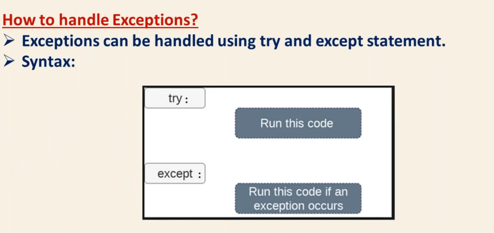

# Exception Handling
* Exception is an Error
* A python progam terminates as soon as it encounters an error 
* Error are of two types in Python:
1. `Syntax Errors` : No way to handle syntax errors
2. `Run-time Errors --> Exceptions` : There is a way to handle exceptions/Runtime errors

## Catching Specific Exceptions in Python
A *try* clause can have any number of *except* clauses to handle different exceptions, however, only one will be executed in case an exception occurs.

We can use a tuple of values to specify multiple exceptions in an *except* clause. Here is an example pseudo code.
```py
try:
   # do something
   pass

except ValueError:
   # handle ValueError exception
   pass

except (TypeError, ZeroDivisionError):
   # handle multiple exceptions
   # TypeError and ZeroDivisionError
   pass

except:
   # handle all other exceptions
   pass
```
