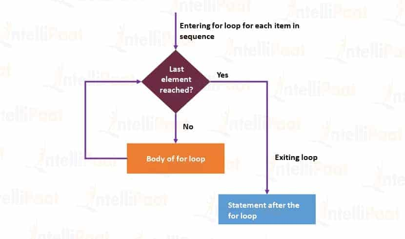

# Loops in python

**Why Loops ?**

All programming language need a way to execute block of code many times , this is possible with loops

Python has two types of loops :
1. for loop
2. while loop

## for loop 
A for loop is used for iterating over a sequence (that is either a list, a tuple, a dictionary, a set, or a string).

This is less like the for keyword in other programming languages, and works more like an iterator method as found in other object-orientated programming languages.

With the for loop we can execute a set of statements, once for each item in a list, tuple, set etc



```py
for x in "banana":
  print(x) 

OUTPUT :

b
a
n
a
n
a
```

## while loop

The while loop in Python is used to iterate over a block of code as long as the test expression (condition) is true


```py
count = 0
while (count < 3):
	count = count + 1
	print("Hello champs")

OUTPUT : 

Hello champs
Hello champs
Hello champs
```
