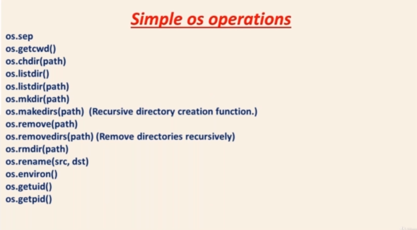
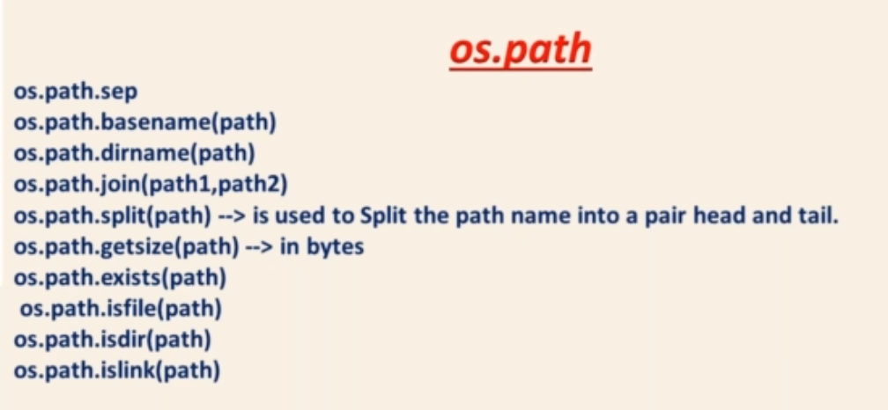

# OS Module
Using this you can work with or interact with your operating system like creating directory , removing directory , identifying current directory , etc.

## OS Module is divided into four parts :
1. os
2. os.path
3. os.system()
4. os.walk()

