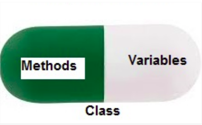

# Encapsulation
* Using OOP in Python, we can restrict access to methods and variables. This prevents data from direct modification which is called encapsulation. 
* In Python, we denote private attributes using underscore as the prefix i.e single _ or double __.

  

  Consider a `real-life example` of encapsulation, in a company, there are different sections like the accounts section, finance section, sales section etc. The finance section handles all the financial transactions and keeps records of all the data related to finance. Similarly, the sales section handles all the sales-related activities and keeps records of all the sales. Now there may arise a situation when for some reason an official from the finance section needs all the data about sales in a particular month. In this case, he is not allowed to directly access the data of the sales section. He will first have to contact some other officer in the sales section and then request him to give the particular data. This is what encapsulation is. Here the data of the sales section and the employees that can manipulate them are wrapped under a single name “sales section”. Using encapsulation also hides the data. In this example, the data of the sections like sales, finance, or accounts are hidden from any other section.