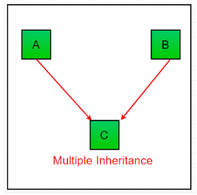
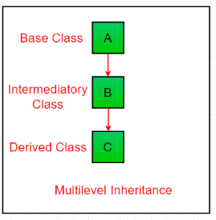
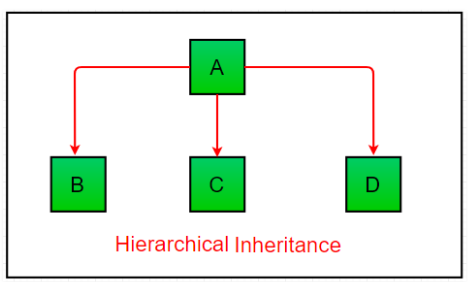

# Inheritance

* Inheritance is a mechanism that allow us to create a new class - known as child class - that is based upon an existing class - the parent class

**`Python Inheritance Syntax :`**
```py
class BaseClass:
  Body of base class
class DerivedClass(BaseClass):
  Body of derived class
```
Derived class inherits features from the base class where new features can be added to it. This results in re-usability of code.

**`Ex -`**
```py
from math import pi


class Shape:
    def __init__(self, name):
        self.name = name

    def area(self):
        pass

    def fact(self):
        return "I am a two-dimensional shape."

    def __str__(self):
        return self.name


class Square(Shape):
    def __init__(self, length):
        super().__init__("Square")
        self.length = length

    def area(self):
        return self.length**2

    def fact(self):
        return "Squares have each angle equal to 90 degrees."


class Circle(Shape):
    def __init__(self, radius):
        super().__init__("Circle")
        self.radius = radius

    def area(self):
        return pi*self.radius**2


a = Square(4)
b = Circle(7)
print(b)
print(b.fact())
print(a.fact())
print(b.area())


OUTPUT :

Circle
I am a two-dimensional shape.
Squares have each angle equal to 90 degrees.
153.93804002589985
```

## Types of Inheritance in Python
Types of Inheritance depends upon the number of child and parent classes involved. There are four types of inheritance in Python:
 

1. **`Single Inheritance:`** Single inheritance enables a derived class to inherit properties from a single parent class, thus enabling code reusability and the addition of new features to existing code.

    

```py
# single inheritance

# Base class
class Parent:
	def func1(self):
		print("This function is in parent class.")

# Derived class
class Child(Parent):
	def func2(self):
		print("This function is in child class.")

# Driver's code
object = Child()
object.func1()
object.func2()

OUTPUT : 

This function is in parent class.
This function is in child class.
```

2. **`Multiple Inheritance:`** When a class can be derived from more than one base class this type of inheritance is called multiple inheritance. In multiple inheritance, all the features of the base classes are inherited into the derived class.

    

```py
# multiple inheritance

# Base class1
class Mother:
	mothername = ""
	def mother(self):
		print(self.mothername)

# Base class2
class Father:
	fathername = ""
	def father(self):
		print(self.fathername)

# Derived class
class Son(Mother, Father):
	def parents(self):
		print("Father :", self.fathername)
		print("Mother :", self.mothername)

# Driver's code
s1 = Son()
s1.fathername = "RAM"
s1.mothername = "SITA"
s1.parents()

OUTPUT :

Father : RAM
Mother : SITA
```

3. **`Multilevel Inheritance:`**
In multilevel inheritance, features of the base class and the derived class are further inherited into the new derived class. This is similar to a relationship representing a child and grandfather. 

```py
# multilevel inheritance

# Base class
class Grandfather:

	def __init__(self, grandfathername):
		self.grandfathername = grandfathername

# Intermediate class
class Father(Grandfather):
	def __init__(self, fathername, grandfathername):
		self.fathername = fathername

		# invoking constructor of Grandfather class
		Grandfather.__init__(self, grandfathername)

# Derived class
class Son(Father):
	def __init__(self,sonname, fathername, grandfathername):
		self.sonname = sonname

		# invoking constructor of Father class
		Father.__init__(self, fathername, grandfathername)

	def print_name(self):
		print('Grandfather name :', self.grandfathername)
		print("Father name :", self.fathername)
		print("Son name :", self.sonname)

# Driver code
s1 = Son('Prince', 'Rampal', 'Lal mani')
print(s1.grandfathername)
s1.print_name()

OUTPUT :

Lal mani
Grandfather name : Lal mani
Father name : Rampal
Son name : Prince
```
4. **`Hierarchical Inheritance:`** When more than one derived classes are created from a single base this type of inheritance is called hierarchical inheritance. In this program, we have a parent (base) class and two child (derived) classes.

   

```py
# Hierarchical inheritance

# Base class
class Parent:
	def func1(self):
		print("This function is in parent class.")

# Derived class1
class Child1(Parent):
	def func2(self):
		print("This function is in child 1.")

# Derivied class2
class Child2(Parent):
	def func3(self):
		print("This function is in child 2.")

# Driver's code
object1 = Child1()
object2 = Child2()
object1.func1()
object1.func2()
object2.func1()
object2.func3()

OUTPUT :

This function is in parent class.
This function is in child 1.
This function is in parent class.
This function is in child 2.
```