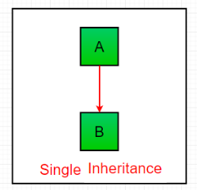

# Inheritance

* Inheritance is a mechanism that allow us to create a new class - known as child class - that is based upon an existing class - the parent class

**`Python Inheritance Syntax :`**
```py
class BaseClass:
  Body of base class
class DerivedClass(BaseClass):
  Body of derived class
```
Derived class inherits features from the base class where new features can be added to it. This results in re-usability of code.

Ex -
```py
from math import pi


class Shape:
    def __init__(self, name):
        self.name = name

    def area(self):
        pass

    def fact(self):
        return "I am a two-dimensional shape."

    def __str__(self):
        return self.name


class Square(Shape):
    def __init__(self, length):
        super().__init__("Square")
        self.length = length

    def area(self):
        return self.length**2

    def fact(self):
        return "Squares have each angle equal to 90 degrees."


class Circle(Shape):
    def __init__(self, radius):
        super().__init__("Circle")
        self.radius = radius

    def area(self):
        return pi*self.radius**2


a = Square(4)
b = Circle(7)
print(b)
print(b.fact())
print(a.fact())
print(b.area())


OUTPUT :

Circle
I am a two-dimensional shape.
Squares have each angle equal to 90 degrees.
153.93804002589985
```

## Types of Inheritance in Python
Types of Inheritance depends upon the number of child and parent classes involved. There are four types of inheritance in Python:
 

1. **`Single Inheritance:`** Single inheritance enables a derived class to inherit properties from a single parent class, thus enabling code reusability and the addition of new features to existing code.


```py
# single inheritance

# Base class
class Parent:
	def func1(self):
		print("This function is in parent class.")

# Derived class
class Child(Parent):
	def func2(self):
		print("This function is in child class.")

# Driver's code
object = Child()
object.func1()
object.func2()
```