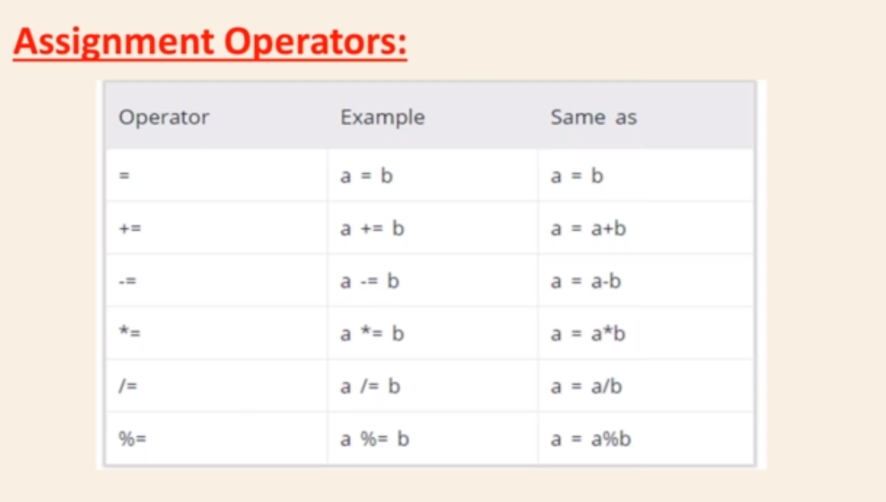

# Assignment Operator
Assignment operators are used in Python to assign values to variables. a = 5 is a simple assignment operator that assigns the value 5 on the right to the variable a on the left.

