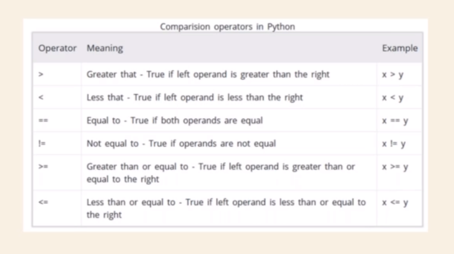

# Comparison Operator
These operators compare the values on either sides of them and decide the relation among them. They are also called Relational operators



---

NOTE :
Comparison based on number system is easy but the string is compared based on their `ASCII code`
```
Ex- 'a' < 'b' = True ( Because ord('a') = 97 & ord('b') = 98)
```
> To find ASCII code of a string

  `ord('a') , ord('+')`

> Character form ASCII code

 `chr(45) , chr(97)`

 NOTE : When we compare multiple char string

 `'aa'  < 'b'` : First char is compared to first char on other side