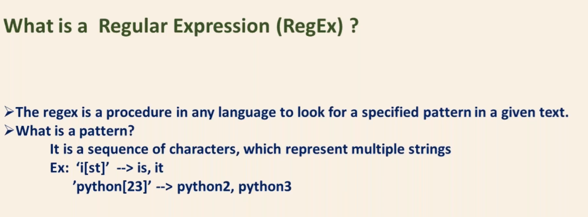
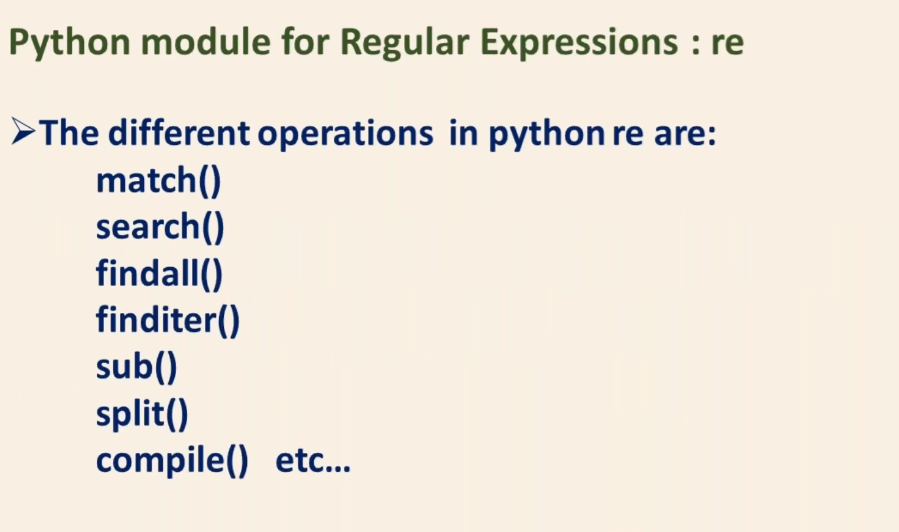

# Regular Expression (RegEx)

> **What is Regular Expression (RegEx) ?**

* The regex is a procedure in any language to look for a specified pattern in a given text

> _**What is pattern ?**_

* It is a sequence of characters , which represent multiple strings

**Python Module for RegEx : `re`** 

